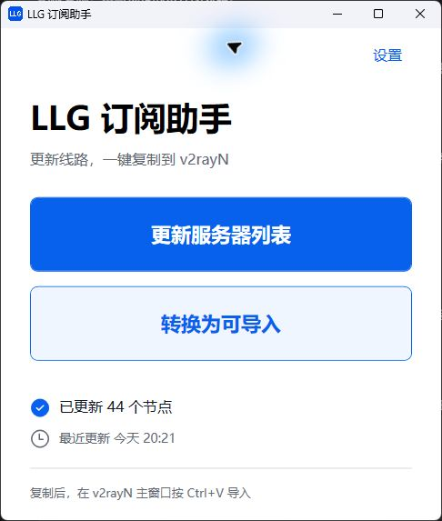

# LLG 订阅助手

Windows 桌面工具：登录 LLG 获取第一方服务器列表，转换为 v2rayN 分享链接并复制到剪贴板。

**[下载最新版本](https://github.com/Jiangyicoder/LLGNEW-Server-Trans/releases/latest)** · [v1.0.0 发布说明](https://github.com/Jiangyicoder/LLGNEW-Server-Trans/releases/tag/v1.0.0)



## 运行

运行 `dist/LLG订阅助手.exe`。Windows 10/11 x64，无需另外安装 .NET、Python 或 Node。

主界面只有“更新服务器列表”“转换为可导入”“设置”三个应用按钮。

1. 在设置中保存自己的用户名、密码。
2. 更新服务器列表，等待显示节点数量。
3. 转换为可导入，然后在 v2rayN 主窗口按 Ctrl+V。

详细说明见 `使用说明.txt`。

Release 中的 EXE 约 63 MiB，已包含 .NET 10 / WPF 运行环境并启用压缩。项目代码与界面资源本身体积较小，运行环境是主要体积来源。

## 行为与数据

- 默认服务端：`https://llgapp.bwespv.com`。
- 登录：`POST /backend/auth/login`，multipart 字段 `username`、`password`。
- 列表：`GET /backend/user/sub`，`Authorization` 使用登录响应中的 token 原值，不加 Bearer。
- 兼容原客户端的 `ua-v: 1.2.15` 和 `ua-c: 4`。
- 解码成功响应的 `data`：Base64 解码，前 16 字节为 IV，其余为 AES-256-CBC / PKCS#7；兼容未加密的成功响应。解密兼容常量取自已分析的原客户端，不是任何用户的账号密钥。
- 只使用认证接口返回的第一方列表。收到未知协议或连接字段时明确报错，整批不生成不完整结果。
- VLESS 当前支持 TCP、无 TLS、`encryption=none`；AnyTLS 保留 SNI 与证书校验选项。格式基准为 v2rayN 7.24.9。
- 分享链接只包含节点连接参数；DNS、策略组、路由规则由 v2rayN 管理。
- 更新失败保留最近一次成功的快照；切换用户名清除旧账号快照。
- `%LOCALAPPDATA%/LLG.SubscriptionHelper/state.dat` 使用 Windows DPAPI 的 CurrentUser 范围加密整个状态，包含账号与节点缓存。以临时文件完成写入后原子替换。
- 登录 token 只在当前更新请求中使用，不写入状态文件。源码与 EXE 不包含用户账号。
- 请求默认保留 HTTPS 证书验证，禁止自动跳转，不把凭据发送到备用域名。

## 开发与打包

项目使用 C#、WPF、.NET 10；依赖 YamlDotNet 18.1.0、ProtectedData 10.0.11。

安装 .NET 10 SDK 后，在项目目录运行：

```powershell
./publish.ps1
```

也可以直接发布：

```text
dotnet publish src/LLG.Helper/LLG.Helper.csproj -c Release -r win-x64 -o artifacts/win-x64
```

项目属性已设置独立运行、单文件发布、包含原生库、压缩、禁用裁剪。原生依赖会由 .NET 在首次启动时自行解压到当前用户的临时目录。

`tools/prepare_build.py` 是可选开发准备脚本，用于下载并校验官方 SDK、取得官方 Fluent 图标。已提交图标资源，普通打包不需要运行此脚本或安装 Python。

## 检查

运行不含账号的本地检查：

```text
dotnet run --project tests/LLG.CoreChecks/LLG.CoreChecks.csproj -c Release -- qa
```

可以在其后附加一个本地第一方 YAML 文件和已验证的分享链接文件，执行逐字比较。检查工具的 `live` 模式仅从标准输入读取明确授权的测试凭据，并使用指定的隔离数据目录；不要把真实凭据写进源码或命令行参数。

- `qa/core-checks.json`：解析、协议参数、认证请求、加密存储、换账号、损坏缓存、错误响应等检查。
- `qa/v2rayn-database-check.json`：只读核对本机 v2rayN 已保存的 44 个第一方节点；该检查没有修改数据库或切换代理。
- `qa/acceptance.json`：最终程序验收与制品信息。
- `design-qa.md`：选定设计与实际窗口的对照记录。

`LLG_HELPER_DATA_DIR` 仅用于开发时指定隔离数据目录；正常双击不需要设置。账号、原始 YAML、分享链接等私密测试文件位于 `qa/private/`，不进入源码交付包。

## 来源与许可

- YAML 解析：[YamlDotNet](https://github.com/aaubry/YamlDotNet)，MIT。
- 状态图标：[Microsoft Fluent System Icons](https://github.com/microsoft/fluentui-system-icons)，MIT；原始路径与哈希见 `src/LLG.Helper/Assets/icons-source.json`，许可证见同目录 `Fluent-LICENSE.txt`。
- 窗口图标由选定的设计图生成，PNG 与 ICO 已嵌入程序。
- [v2rayN VLESS 解析器](https://github.com/2dust/v2rayN/blob/7.24.9/v2rayN/ServiceLib/Handler/Fmt/VLESSFmt.cs)、[AnyTLS 解析器](https://github.com/2dust/v2rayN/blob/7.24.9/v2rayN/ServiceLib/Handler/Fmt/AnytlsFmt.cs) 是格式对照来源；本程序没有嵌入 v2rayN 原代码。
- [.NET 单文件发布](https://learn.microsoft.com/en-us/dotnet/core/deploying/single-file/overview)、[Windows DPAPI](https://learn.microsoft.com/en-us/dotnet/api/system.security.cryptography.protecteddata?view=windowsdesktop-10.0)。
